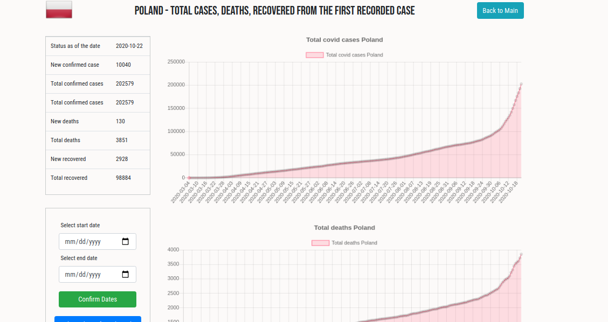

## COVID Flask app

Flask app gathering information about actually 
COVID 19 situation

###  Flask, Bootstrap, JavaScript with Canvas

Data collected from:
    
   - [COVID19 API LINK](https://documenter.getpostman.com/view/10808728/SzS8rjbc)
    
Steps: 
    pip install -r requirements.txt
    python run.py
    http://http://127.0.0.1:5000/covid/summary
    
    Select country and check actually situation:
    

    You can check data for particular period
    

    